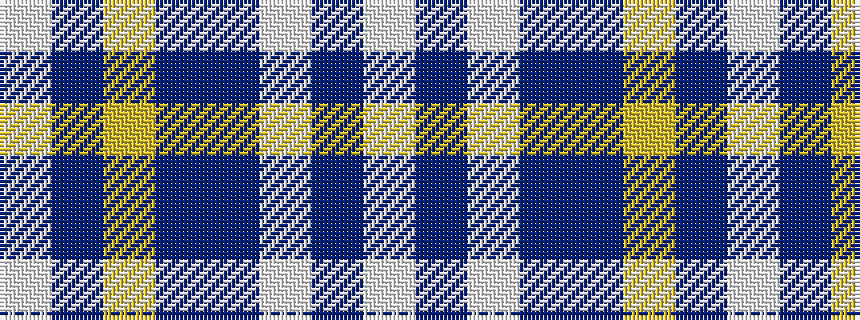

WBWBBYBW

It is a 8 stripe tartan.

<figure class="pat-woven">

<figcaption>idealised sample</figcaption>
</figure>

## Colour Sequence



## Tartans with this colour sequence

| Tartans |
|---------------|
| [Gorman Blue (Personal)](/variants/s8/w4n1ly2n22dt20w2dt4w2~x2/)|
||
| [Gorman Blue (Personal)](/variants/s8/w4t1lo2t22b20w2b4w2~x2/)|
||
