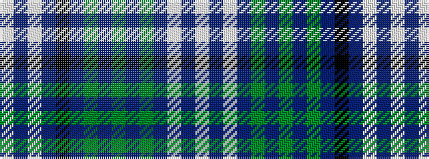

WBWBGBGBGBKBWBW

It is a 15 stripe tartan.

<figure class="pat-woven">

<figcaption>idealised sample</figcaption>
</figure>

## Colour Sequence



## Tartans with this colour sequence

| Tartans |
|---------------|
| [Thistle Dubh](/variants/s15/w5n3w3n20k15n10g2n2g3n2g3n6lp3n4lp5~x2/)|
||
