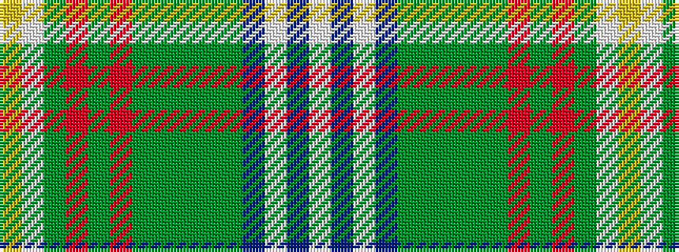

WBWBGGGGGRGRGWY

It is a 15 stripe tartan.

<figure class="pat-woven">

<figcaption>idealised sample</figcaption>
</figure>

## Colour Sequence



## Tartans with this colour sequence

| Tartans |
|---------------|
| [Anstey (Personal)](/setts/s15/w6db6w3db44dg20g8dg2g8dg6r3dg2r3dg4w25lo4/)|
||
| [Anstey in New Scotland (Personal)](/setts/s15/w6b6w3b44g20g8g2g8g6r3g2r3g4w25ly4/)|
||
