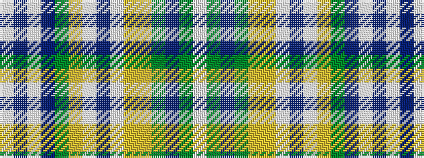

WBWBGYWBWYYGBGW

It is a 15 stripe tartan.

<figure class="pat-woven">

<figcaption>idealised sample</figcaption>
</figure>

## Colour Sequence



## Tartans with this colour sequence

| Tartans |
|---------------|
| [Bonnie Prince Charlie (Hudson Bay)](/setts/s15/w9dy14do11dy3lo11ly7w1do3w1ly7dy7do3w2t2w2~x2/)|
||
