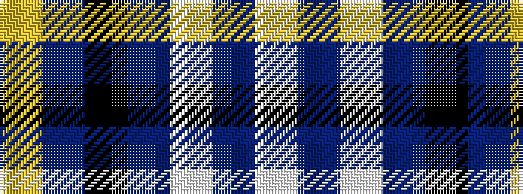

WBWBKBY

It is a 7 stripe tartan.

<figure class="pat-woven">

<figcaption>idealised sample</figcaption>
</figure>

## Colour Sequence



## Tartans with this colour sequence

| Tartans |
|---------------|
| [Torridon, Saphire (Dance)](/setts/s7/w3dbi2w30db30k2db2ly3~x2/)|
||
