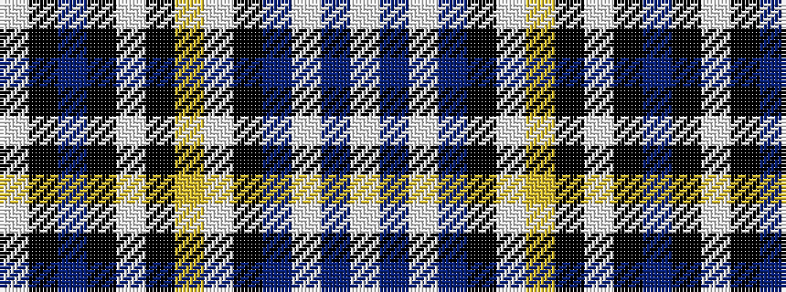

WBWBKWYKWKBKW

It is a 13 stripe tartan.

<figure class="pat-woven">

<figcaption>idealised sample</figcaption>
</figure>

## Colour Sequence



## Tartans with this colour sequence

| Tartans |
|---------------|
| [Silverton (Name)](/variants/s13/lb4b1w1b1k29lb3ly1k4lb20k2db1k3lb3~x2/)|
||
