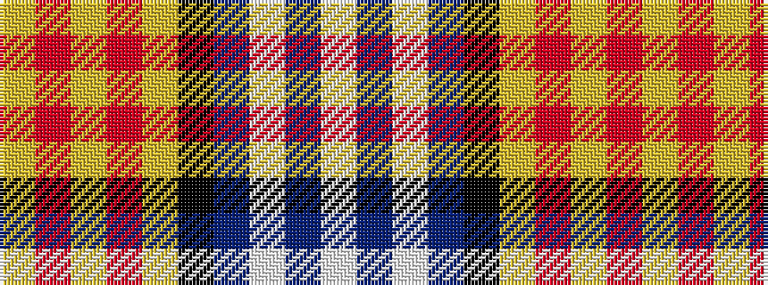

WBWBKYRYRY

It is a 10 stripe tartan.

<figure class="pat-woven">

<figcaption>idealised sample</figcaption>
</figure>

## Colour Sequence



## Tartans with this colour sequence

| Tartans |
|---------------|
| [Catalunya Escocia](/setts/s10/ly6r6ly6r6ly6k1db18w2db1w4~x2/)|
||
