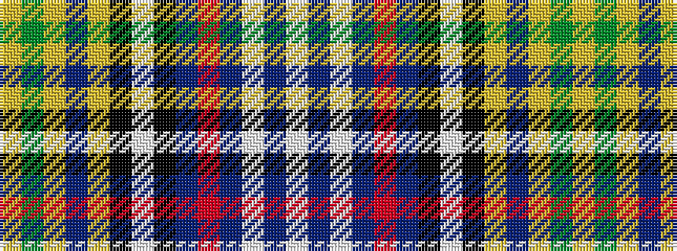

WBWBRBKWKYBYGY

It is a 14 stripe tartan.

<figure class="pat-woven">

<figcaption>idealised sample</figcaption>
</figure>

## Colour Sequence



## Tartans with this colour sequence

| Tartans |
|---------------|
| [Redgate Dress (Name)](/setts/s14/lb7db4lb2db7r2db7k6lb1k6lo5db3lo3y13lo4~x2/)|
||
