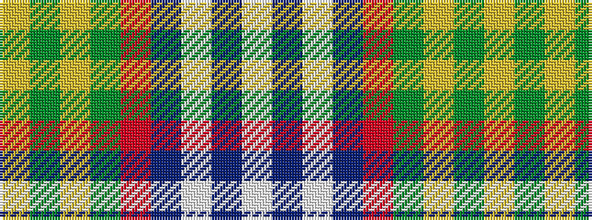

WBWBRGYGY

It is a 9 stripe tartan.

<figure class="pat-woven">

<figcaption>idealised sample</figcaption>
</figure>

## Colour Sequence



## Tartans with this colour sequence

| Tartans |
|---------------|
| [Forrester (Clan)](/setts/s9/w3dt4w1dt15r24dg15ly1dg4ly3~x4/)|
||
| [Forrester / Foster](/setts/s9/w4db6w1db15r23g15ly1g6ly4~x2/)|
||
