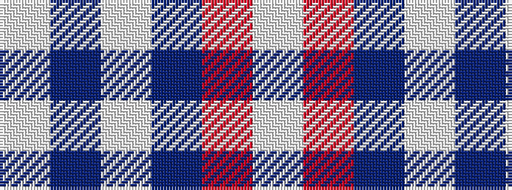

WBWBRW

It is a 6 stripe tartan.

<figure class="pat-woven">

<figcaption>idealised sample</figcaption>
</figure>

## Colour Sequence



## Tartans with this colour sequence

| Tartans |
|---------------|
| [Burns (Fashion)](/variants/s6/w15do6w1do3o3w1~x4/)|
||
| [Montrose Football Club](/variants/s6/w6r13dt80w4dt2w4/)|
||
