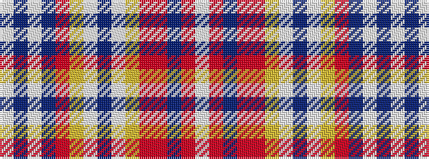

WBWBRYWBWYRRBRW

It is a 15 stripe tartan.

<figure class="pat-woven">

<figcaption>idealised sample</figcaption>
</figure>

## Colour Sequence



## Tartans with this colour sequence

| Tartans |
|---------------|
| [Hudson Bay Company Artifact](/setts/s15/w9o14dr11o3o11ly7w1dr3w1ly7o7dr3w2b2w2~x2/)|
||
