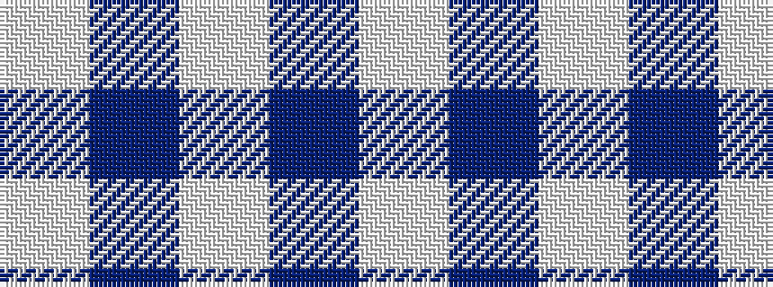

WBWBW

It is a 5 stripe tartan.

<figure class="pat-woven">

<figcaption>idealised sample</figcaption>
</figure>

## Colour Sequence



## Tartans with this colour sequence

| Tartans |
|---------------|
| [Asahi (Estimated threadcount)](/setts/s5/w45b2w4b15w7~x2/)|
||
| [Sephardim (Corporate)](/setts/s5/w50db7w7t7w18~x2/)|
||
