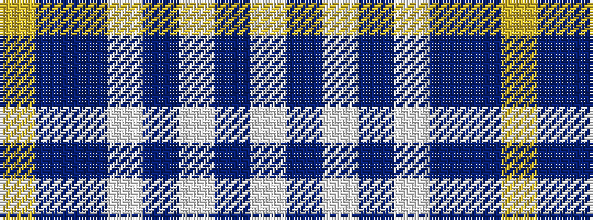

WBWBWBBY

It is a 8 stripe tartan.

<figure class="pat-woven">

<figcaption>idealised sample</figcaption>
</figure>

## Colour Sequence



## Tartans with this colour sequence

| Tartans |
|---------------|
| [Culloden, Blue Dress (Dance)](/setts/s8/ly8db4t23w3db22w25db3w6~x2/)|
||
