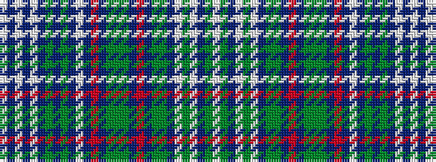

WBWBWBGBGBWBRBGGGBRBGGBWGWBGW

It is a 29 stripe tartan.

<figure class="pat-woven">

<figcaption>idealised sample</figcaption>
</figure>

## Colour Sequence



## Tartans with this colour sequence

| Tartans |
|---------------|
| [House of Timber Wolf (Personal)](/setts/s29/w23dt2w2dt2w2dt22g12dt2g12dt10w3dt1o2dt10y8g4y8dt10o2dt1g5y23dt22w2g2w2dt2y2w2~x2/)|
||
