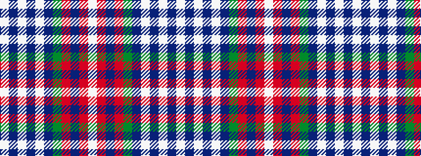

WBWBWBGRBRW

It is a 11 stripe tartan.

<figure class="pat-woven">

<figcaption>idealised sample</figcaption>
</figure>

## Colour Sequence



## Tartans with this colour sequence

| Tartans |
|---------------|
| [Grotto Dove (Dance)](/variants/s11/w102db20w4db4w4db4dg20r18db3r10w4/)|
||
