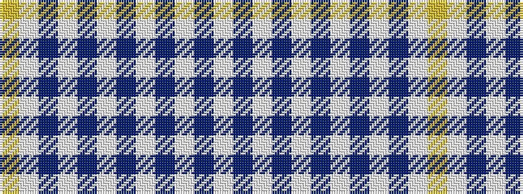

WBWBWBWBWBWY

It is a 12 stripe tartan.

<figure class="pat-woven">

<figcaption>idealised sample</figcaption>
</figure>

## Colour Sequence



## Tartans with this colour sequence

| Tartans |
|---------------|
| [Moskyok-Collins (Portland) (Personal](/setts/s12/ly6w2n4lb1dbi6lb1db40lb1dbi6lb1n4w4~x2/)|
||
