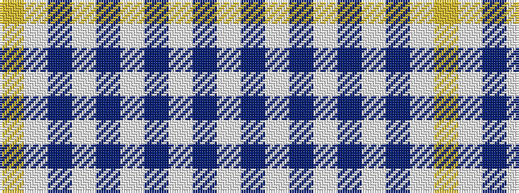

WBWBWBWBWY

It is a 10 stripe tartan.

<figure class="pat-woven">

<figcaption>idealised sample</figcaption>
</figure>

## Colour Sequence



## Tartans with this colour sequence

| Tartans |
|---------------|
| [Traynor](/setts/s10/ly2lb2db3lb30db4lb3db4lb3db18lb2~x2/)|
||
