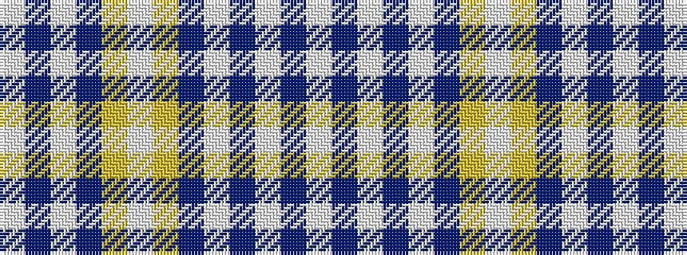

WBWBWBYWYBWBW

It is a 13 stripe tartan.

<figure class="pat-woven">

<figcaption>idealised sample</figcaption>
</figure>

## Colour Sequence



## Tartans with this colour sequence

| Tartans |
|---------------|
| [Poulter, Pink (Corporate)](/setts/s13/lb25dp4lb4dp4lb4dp23lr23w4lr23dp23lb23dp4lb4~x2/)|
||
