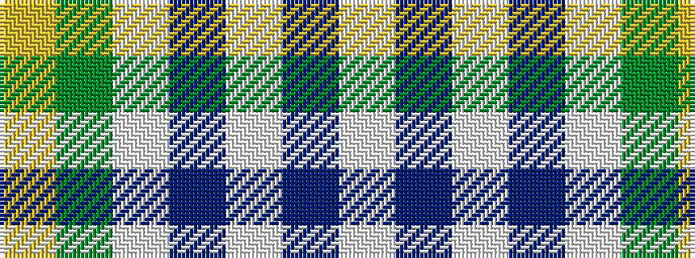

WBWBWGY

It is a 7 stripe tartan.

<figure class="pat-woven">

<figcaption>idealised sample</figcaption>
</figure>

## Colour Sequence



## Tartans with this colour sequence

| Tartans |
|---------------|
| [Pearce Scotch Plaid 4 (Fashion)](/variants/s7/ly6dg36w5b4w30b1w2~x2/)|
||
