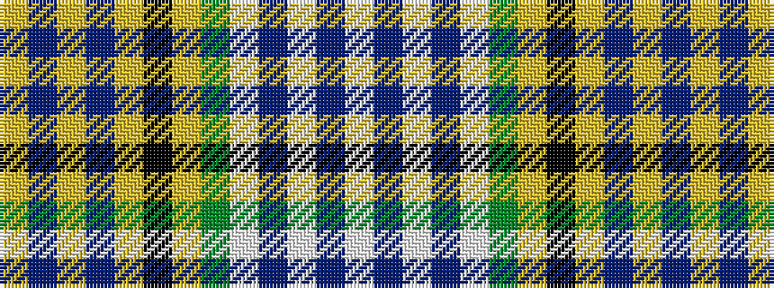

WBWBWGYKYBYBY

It is a 13 stripe tartan.

<figure class="pat-woven">

<figcaption>idealised sample</figcaption>
</figure>

## Colour Sequence



## Tartans with this colour sequence

| Tartans |
|---------------|
| [Tom Morris (Official)](/setts/s13/lr38p5lr6p5lr4k20lr38y12w3n30w3n2w7/)|
||
