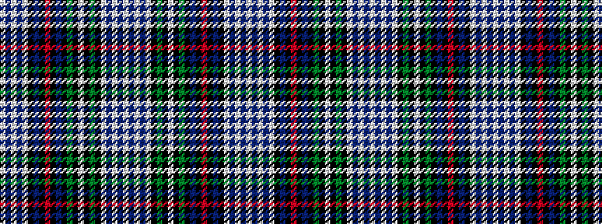

WBWBWKBKRKBKGKWKGKWBWBW

It is a 23 stripe tartan.

<figure class="pat-woven">

<figcaption>idealised sample</figcaption>
</figure>

## Colour Sequence



## Tartans with this colour sequence

| Tartans |
|---------------|
| [MacKenzie Dress #3](/variants/s23/w2db2w53db2w2k15dg15k2w3k2dg15k15db14k2r3k2db14k15w2db2w53db2w2~x2/)|
||
| [MacKenzie, dress](/variants/s23/w2db2w53db2w2k15g15k2w3k2g15k15db14k2r3k2db14k15w2db2w53db2w2~x2/)|
||
