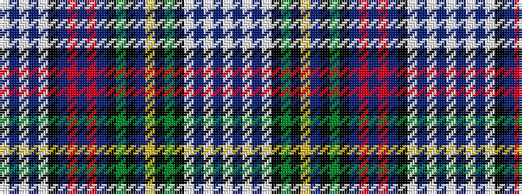

WBWBWKBRBRBKGKBYKGKWBWBW

It is a 24 stripe tartan.

<figure class="pat-woven">

<figcaption>idealised sample</figcaption>
</figure>

## Colour Sequence



## Tartans with this colour sequence

| Tartans |
|---------------|
| [Malcolm Dress Clan Tartan Tartan Number: 1785. Earliest known date: c.1890 Paton's collection dates from 1830 and spans the whole of the Victorian era. This dress sett probably dates from 1890's when many new dress tartans were introduced. Dress Malcolm is based on the sett first recorded in Wilson's of Bannockburn's pattern books of 1847. The gold and azure colours can be found in the Malcolm family armourial bearings. See products available Copyright © Blair Urquhart, Comrie, 2015](/setts/s24/w4dbi4w50dbi5w5k26g27k4ly4db4k4g27k25dbi23r3dbi10r3dbi23k25w5dbi5w50dbi4w4/)|
||
| [Malcolm, dress](/setts/s24/w4db4w50db5w5k26g27k4ly4dbi4k4g27k25db23r3db10r3db23k25w5db5w50db4w4/)|
||
