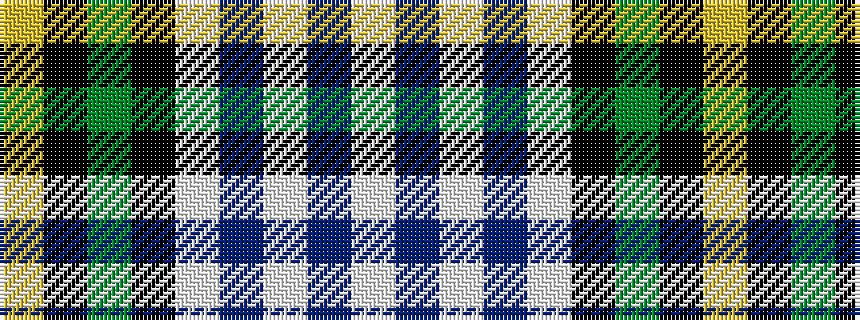

WBWBWKGKY

It is a 9 stripe tartan.

<figure class="pat-woven">

<figcaption>idealised sample</figcaption>
</figure>

## Colour Sequence



## Tartans with this colour sequence

| Tartans |
|---------------|
| [Henderson Dress](/variants/s9/w1b6w4b1w16k1g4k6ly1~x2/)|
||
| [Henderson Dress (Clan?)](/variants/s9/w1t6w4t1w16k1g4k6ly1~x2/)|
||
