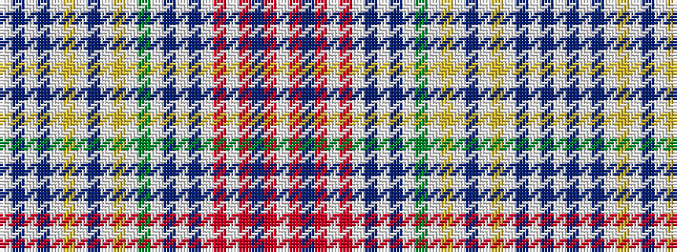

WBWBWYWBWYWGWBWBWRWRBRW

It is a 23 stripe tartan.

<figure class="pat-woven">

<figcaption>idealised sample</figcaption>
</figure>

## Colour Sequence



## Tartans with this colour sequence

| Tartans |
|---------------|
| [Lasting](/variants/s23/w2p7w2t6w2ly4w2p4w2ly4w2g19w2p7w2p7w2r19w4r3t2r3w2~x2/)|
||
| [Lasting Family Tartan](/variants/s23/w2dp7w2t6w2ly4w2dp4w2ly4w2g19w2dp7w2dp7w2r19w4r3t2r3w2~x2/)|
||
