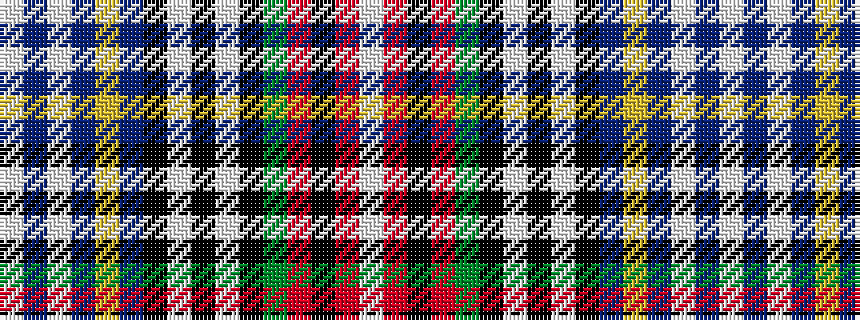

WBWBYBKWKWKGRKRW

It is a 16 stripe tartan.

<figure class="pat-woven">

<figcaption>idealised sample</figcaption>
</figure>

## Colour Sequence



## Tartans with this colour sequence

| Tartans |
|---------------|
| [MacBeth Dress (Clan)](/variants/s16/w1r3k1r3g4k1w1k1w1k1db6lo2db4w14db1w1~x4/)|
||
