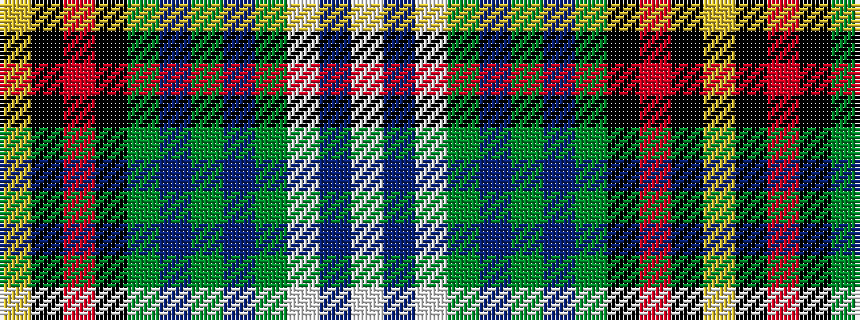

WBWGBGBGKRKY

It is a 12 stripe tartan.

<figure class="pat-woven">

<figcaption>idealised sample</figcaption>
</figure>

## Colour Sequence



## Tartans with this colour sequence

| Tartans |
|---------------|
| [Down County Crest (Fashion)](/setts/s12/lo8k3r6k2g20db4g2db4g5lb4db3w3~x2/)|
||
