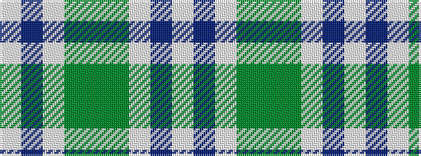

WBWGGGWBW

It is a 9 stripe tartan.

<figure class="pat-woven">

<figcaption>idealised sample</figcaption>
</figure>

## Colour Sequence



## Tartans with this colour sequence

| Tartans |
|---------------|
| [Bird Family (Australia) (Personal)](/variants/s9/w3n19w1yii17y11yi10w1n3w1~x2/)|
||
