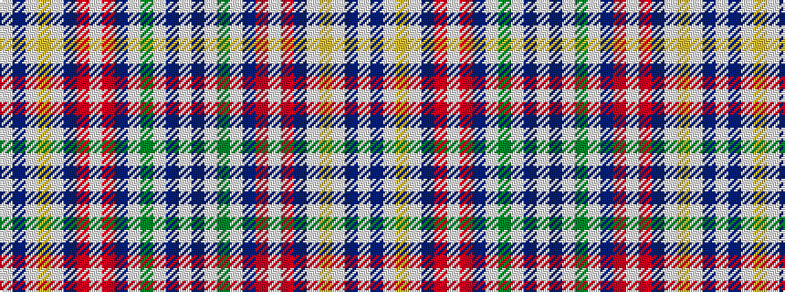

WBWGWBRWRBWYWBW

It is a 15 stripe tartan.

<figure class="pat-woven">

<figcaption>idealised sample</figcaption>
</figure>

## Colour Sequence



## Tartans with this colour sequence

| Tartans |
|---------------|
| [Wombles](/setts/s15/w5db2w1g8w1db2r2w1r2db2w1lo8w1db2w5~x2/)|
||
| [Wombles 1 (Corporate)](/setts/s15/w3db1w1g5w1db1r2w1r2db1w1lo4w1db1w3~x8/)|
||
| [Wombles 5 (Corporate)](/tartans/w5db2w1g8w1db2m2w1m2db2w1lo8w1db2w5/)|
||
