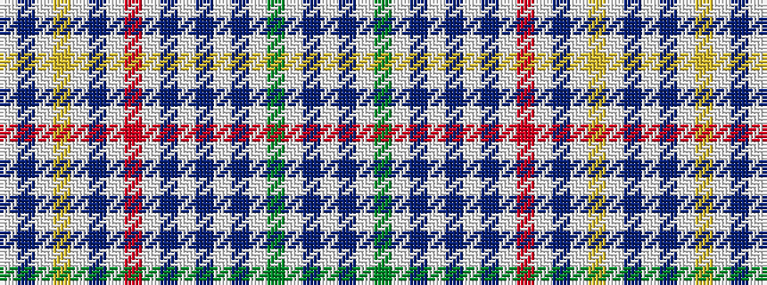

WBWGWBWBWBWRWBWYWBW

It is a 19 stripe tartan.

<figure class="pat-woven">

<figcaption>idealised sample</figcaption>
</figure>

## Colour Sequence



## Tartans with this colour sequence

| Tartans |
|---------------|
| [Four Quarters (Personal)](/variants/s19/w7dp7w1g13w1dp2w1db14w1dp2w1r11w1dp2w1ly7w1dp2w7~x2/)|
||
