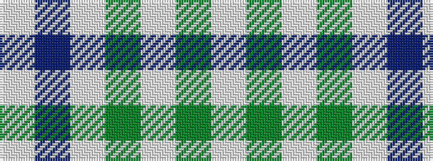

WBWGWGW

It is a 7 stripe tartan.

<figure class="pat-woven">

<figcaption>idealised sample</figcaption>
</figure>

## Colour Sequence



## Tartans with this colour sequence

| Tartans |
|---------------|
| [Leblant-Macqueron (Personal)](/setts/s7/lb5dy6w2g7w2b44w2~x2/)|
||
