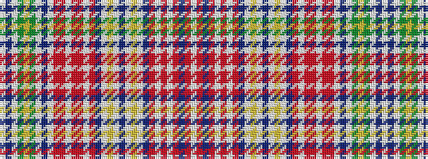

WBWGYGWBWRRWRRWRBWYWBWYWBRWRWRBRW

It is a 33 stripe tartan.

<figure class="pat-woven">

<figcaption>idealised sample</figcaption>
</figure>

## Colour Sequence



## Tartans with this colour sequence

| Tartans |
|---------------|
| [Culloden House Bed Hangings](/variants/s33/w4t5w2dg2ly3dg2w2dp12w2ri8r8w2r8ri8w2ri10db4w2ly3w2db4w2ly3w2db4ri10w2r20w6r4db2r4w2~x2/)|
||
| [Culloden, House Bed Hangings](/variants/s33/w4t5w2g2ly3g2w2p12w2r8ri8w2ri8r8w2r10db4w2ly3w2db4w2ly3w2db4r10w2ri20w6ri4db2ri4w2~x2/)|
||
