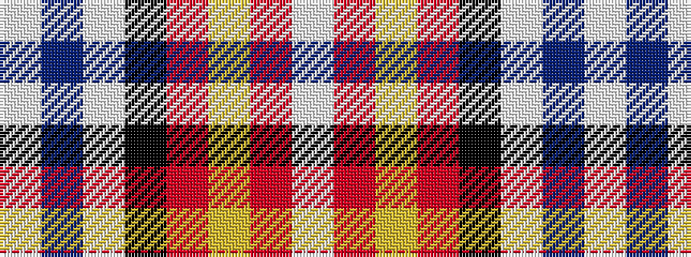

WBWKRYRW

It is a 8 stripe tartan.

<figure class="pat-woven">

<figcaption>idealised sample</figcaption>
</figure>

## Colour Sequence



## Tartans with this colour sequence

| Tartans |
|---------------|
| [Brunnbauer (2015)](/variants/s8/w4t32w12k5r9lo8r4w4~x2/)|
||
