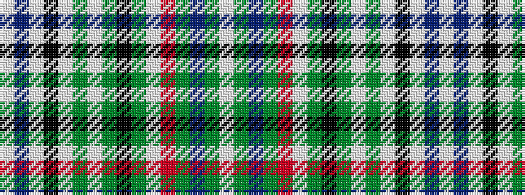

WBWKWGWGKGWRGBGW

It is a 16 stripe tartan.

<figure class="pat-woven">

<figcaption>idealised sample</figcaption>
</figure>

## Colour Sequence



## Tartans with this colour sequence

| Tartans |
|---------------|
| [Beckett Beaumont](/setts/s16/w54dt7w19k5w8y8w8y16k8dy8w21r11y7dt11y8w7~x2/)|
||
