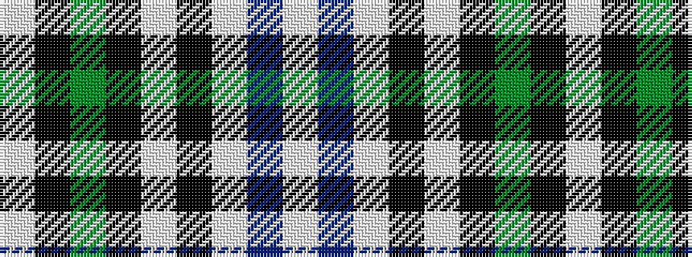

WBWKWKGKW

It is a 9 stripe tartan.

<figure class="pat-woven">

<figcaption>idealised sample</figcaption>
</figure>

## Colour Sequence



## Tartans with this colour sequence

| Tartans |
|---------------|
| [Unidentified (shirt fabric)](/variants/s9/w5db3w25k2w2k16g8k1w4/)|
||
