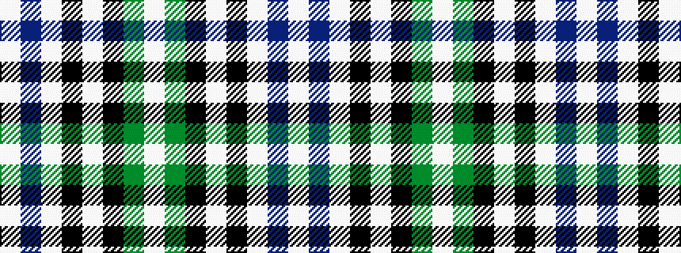

WBWKWKGW

It is a 8 stripe tartan.

<figure class="pat-woven">

<figcaption>idealised sample</figcaption>
</figure>

## Colour Sequence



## Tartans with this colour sequence

| Tartans |
|---------------|
| [Forbes - 1880 (Clans Originaux)](/variants/s8/w2g4k7w2k1w11db2w2~x4/)|
||
