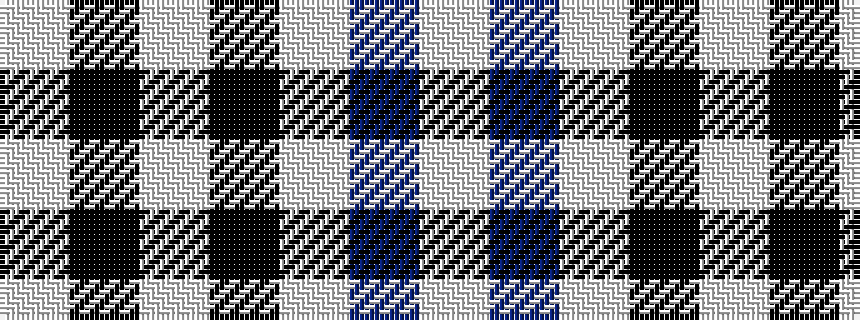

WBWKWKW

It is a 7 stripe tartan.

<figure class="pat-woven">

<figcaption>idealised sample</figcaption>
</figure>

## Colour Sequence



## Tartans with this colour sequence

| Tartans |
|---------------|
| [Forbes Dress (Clans Originaux)](/setts/s7/w6b3w20k2w3k25w3~x2/)|
||
