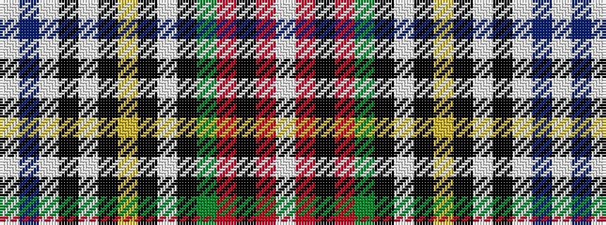

WBWKWKYKWKGRKRW

It is a 15 stripe tartan.

<figure class="pat-woven">

<figcaption>idealised sample</figcaption>
</figure>

## Colour Sequence



## Tartans with this colour sequence

| Tartans |
|---------------|
| [Stewart dress](/variants/s15/w16db3w8k3w3k6ly2k2w2k2g7r4k2r2w2~x2/)|
||
| [Stuart/Stewart Dress #2](/variants/s15/w16db3w8k3w3k6ly2k2w2k2dg7r4k2r2w2~x2/)|
||
