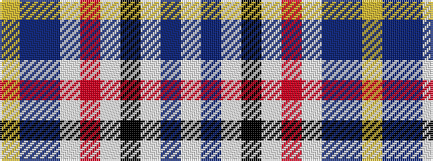

WBWKWRWBBY

It is a 10 stripe tartan.

<figure class="pat-woven">

<figcaption>idealised sample</figcaption>
</figure>

## Colour Sequence



## Tartans with this colour sequence

| Tartans |
|---------------|
| [Leitrim, County](/setts/s10/lo3do2n18lb3o13lb4k3lb4do18lb3~x2/)|
||
