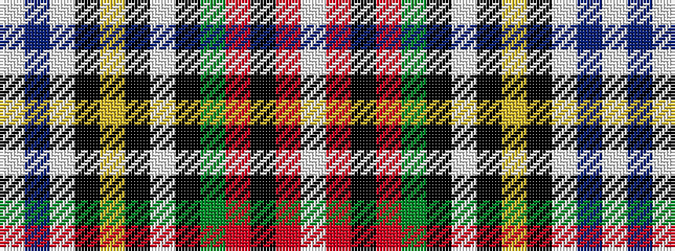

WBWKYKWKGRKRW

It is a 13 stripe tartan.

<figure class="pat-woven">

<figcaption>idealised sample</figcaption>
</figure>

## Colour Sequence



## Tartans with this colour sequence

| Tartans |
|---------------|
| [Stewart Dress (Artefact)](/setts/s13/lb50db6lb2k6ly2k3lb2k3g6r6k2r2lb2~x2/)|
||
