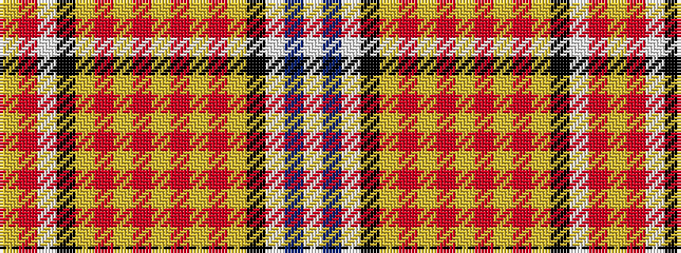

WBWKYRYRYRYRYKWRY

It is a 17 stripe tartan.

<figure class="pat-woven">

<figcaption>idealised sample</figcaption>
</figure>

## Colour Sequence



## Tartans with this colour sequence

| Tartans |
|---------------|
| [Espana](/setts/s17/lb34b5lb3k1ly2r2ly2r2ly2r2ly2r2ly2k1lb3r4ly8~x2/)|
||
