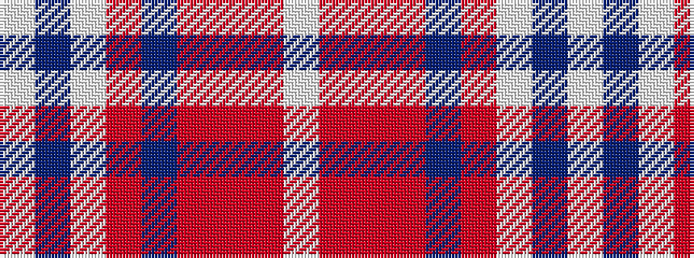

WBWRBRRRW

It is a 9 stripe tartan.

<figure class="pat-woven">

<figcaption>idealised sample</figcaption>
</figure>

## Colour Sequence



## Tartans with this colour sequence

| Tartans |
|---------------|
| [Wombles #5](/setts/s9/w4db8w1r1db6r3r6r1w4~x2/)|
||
