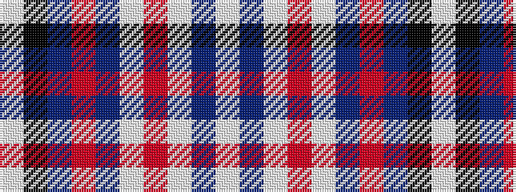

WBWRWBRBKW

It is a 10 stripe tartan.

<figure class="pat-woven">

<figcaption>idealised sample</figcaption>
</figure>

## Colour Sequence



## Tartans with this colour sequence

| Tartans |
|---------------|
| [Spirit of Russia, The](/variants/s10/w4db2w1r2w16db16r16db12k1w4~x2/)|
||
