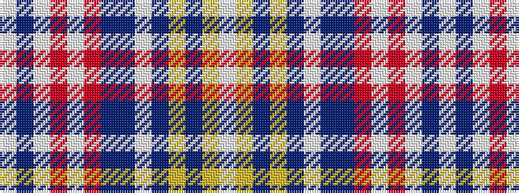

WBWRWRBBWBYBYW

It is a 14 stripe tartan.

<figure class="pat-woven">

<figcaption>idealised sample</figcaption>
</figure>

## Colour Sequence



## Tartans with this colour sequence

| Tartans |
|---------------|
| [De Clercq, Christian Family (Belgium)](/variants/s14/lb3db1lb1r1lb1r1db10b1lb9b35ly2b2ly1lb2~x2/)|
||
