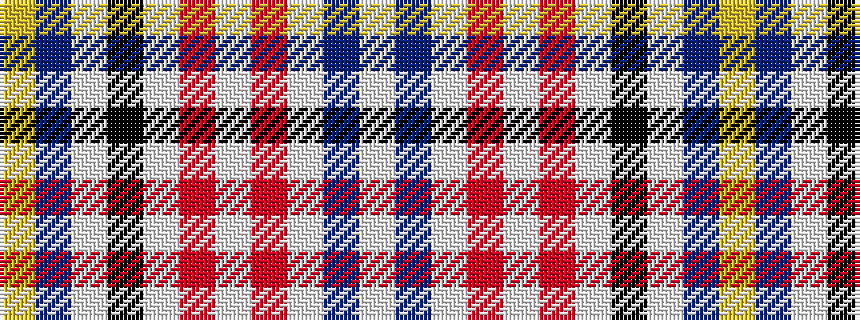

WBWRWRWKWBY

It is a 11 stripe tartan.

<figure class="pat-woven">

<figcaption>idealised sample</figcaption>
</figure>

## Colour Sequence



## Tartans with this colour sequence

| Tartans |
|---------------|
| [Harris (Personal)](/setts/s11/lo1n8lb2k15lb20r1lb1r1lb8n3lb1~x2/)|
||
