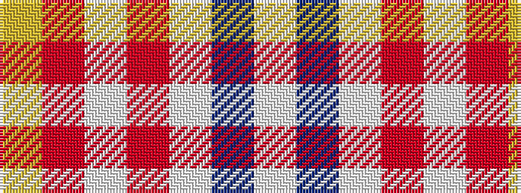

WBWRWRY

It is a 7 stripe tartan.

<figure class="pat-woven">

<figcaption>idealised sample</figcaption>
</figure>

## Colour Sequence



## Tartans with this colour sequence

| Tartans |
|---------------|
| [MacPherson Dress Red (Dance)](/setts/s7/w5dp3w26r20w3r8ly3~x2/)|
||
| [MacPherson, Red](/setts/s7/w5p3w26r20w3r8ly3~x2/)|
||
