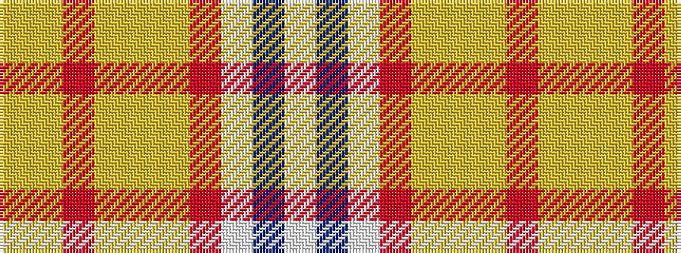

WBWRYYYRYY

It is a 10 stripe tartan.

<figure class="pat-woven">

<figcaption>idealised sample</figcaption>
</figure>

## Colour Sequence



## Tartans with this colour sequence

| Tartans |
|---------------|
| [Confederate Memorial Commemmorative Tartan Tartan Number: 2501. Earliest known date: 1995 Designed by Dr. Philip Smith in 1995. Grey is the colour of the Confederate States of America. The fields represent the Confederate Army in line of battle-- light blue for infantry, flanked by red for artilllery and yellow for outriding cavalry. The red field represents the Confederate flag in true proportions. See products available Copyright © Blair Urquhart, Comrie, 2015](/setts/s10/lg8lr2r3lr2ly2lr28r10lb1db3lb2~x2/)|
||
