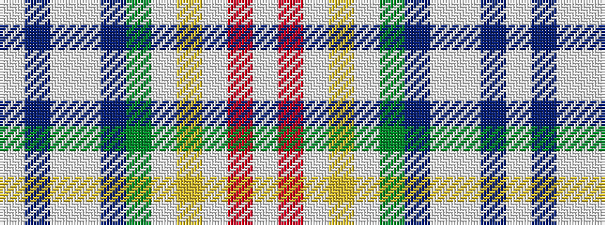

WBWWBGWYWRW

It is a 11 stripe tartan.

<figure class="pat-woven">

<figcaption>idealised sample</figcaption>
</figure>

## Colour Sequence



## Tartans with this colour sequence

| Tartans |
|---------------|
| [Stand International](/setts/s11/lb6r1lb1lo1lb1g1dt9lb6w1dt6lb3~x4/)|
||
