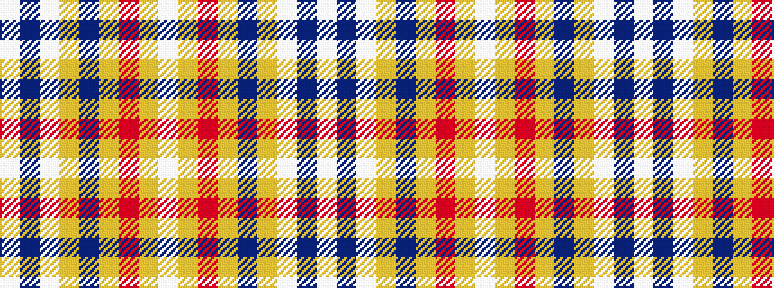

WBWYBYRYW

It is a 9 stripe tartan.

<figure class="pat-woven">

<figcaption>idealised sample</figcaption>
</figure>

## Colour Sequence



## Tartans with this colour sequence

| Tartans |
|---------------|
| [Womble](/variants/s9/w4dbi8w1lo1db6lo3r6lo1w4~x2/)|
||
| [Wombles 6 (Corporate)](/variants/s9/w4db8w1lo1dbi6lo3r6lo1w4~x4/)|
||
