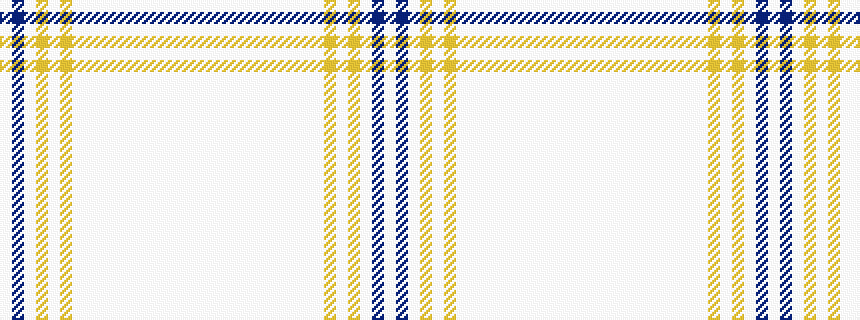

WBWYWYWWWWWWWWWWW

It is a 17 stripe tartan.

<figure class="pat-woven">

<figcaption>idealised sample</figcaption>
</figure>

## Colour Sequence



## Tartans with this colour sequence

| Tartans |
|---------------|
| [Weston-McCue (Personal)](/setts/s17/w2n2w24lr3w2lr3lb9wi2lb2wi2w8wi4w2wi2w36wi2w2~x2/)|
||
