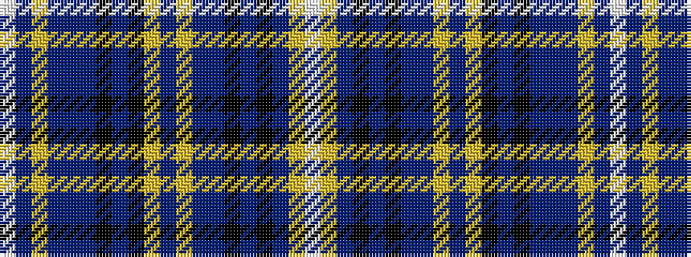

WBYBBBKBKYBYBBKBKBYW

It is a 20 stripe tartan.

<figure class="pat-woven">

<figcaption>idealised sample</figcaption>
</figure>

## Colour Sequence



## Tartans with this colour sequence

| Tartans |
|---------------|
| [McDill (2015)](/variants/s20/w1dr2ly2dr20b1dr1k6dr6k6ly2dr1ly2b6dr3k1dr3k20dr1ly2w1~x2/)|
||
